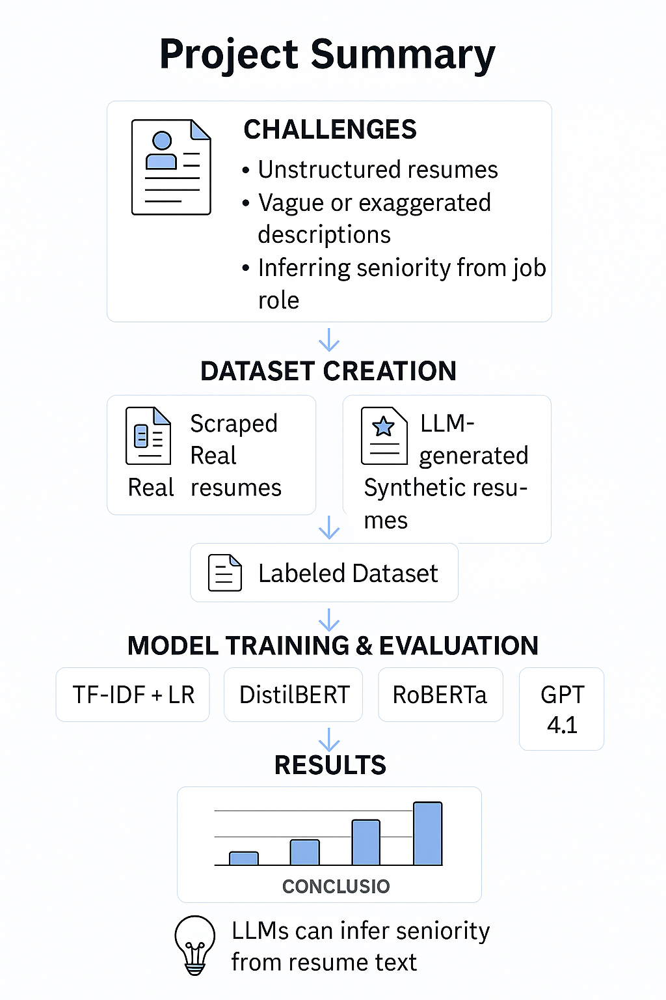

ResumaAnalyzerNLP is a project that collects and analyzes resumes job roles to automatically predict seniority levels (Junior, Mid, Senior). First, we gather data from various sources (web scraping) and augment it with synthetic examples generated by GPT-4. Next, each entry in DATA.xlsx (with columns: Resume, Job Title, Seniority) is labeled—assigning seniority based on the job title for the role—using a combination of manual annotation and rule-based scripts. We then perform exploratory data analysis (EDA) to examine class distributions and text features, and implement a TF-IDF + Logistic Regression baseline to get an initial estimate of classification accuracy.

For model training, we fine-tune two Transformer-based classifiers (DistilBERT and RoBERTa) for 10 epochs on the labeled data. We also run generative inference with GPT-4 via OpenRouter (prompt-only) to see how well a prompt-based approach can classify seniority without additional fine-tuning.  and we save all evaluation graphs (accuracy-vs-epoch curves and confusion matrices) in the results/ folder.

Our results show that the TF-IDF baseline achieves about 81% validation accuracy, GPT prompt-only achieves 78.6%, DistilBERT reaches 87.2% (best at epoch 10 with loss 0.4026), and RoBERTa leads with 90.6% (best at epoch 8 with loss 0.3297). Overall, RoBERTa delivers the strongest performance, while GPT-4 still provides surprisingly effective classification even on unstructured input.


##  📈 Results Summary
TF-IDF + LogisticRegression (baseline): 81.20%

GPT-4 (prompt-only): 78.60%

DistilBERT (fine-tuned): 87.18% (best at epoch 10, val loss 0.4026)

RoBERTa (fine-tuned): 90.60% (best at epoch 8, val loss 0.3297)

RoBERTa achieves the highest seniority-classification accuracy, but GPT-4’s prompt-based approach still performs surprisingly well on unstructured input.


##  ⚙️ Installation

1. **Clone this repository**  
   ```bash
   git clone https://github.com/matancohen1205/ResumaAnalyzerNLP.git
   cd ResumaAnalyzerNLP/SRC


   
